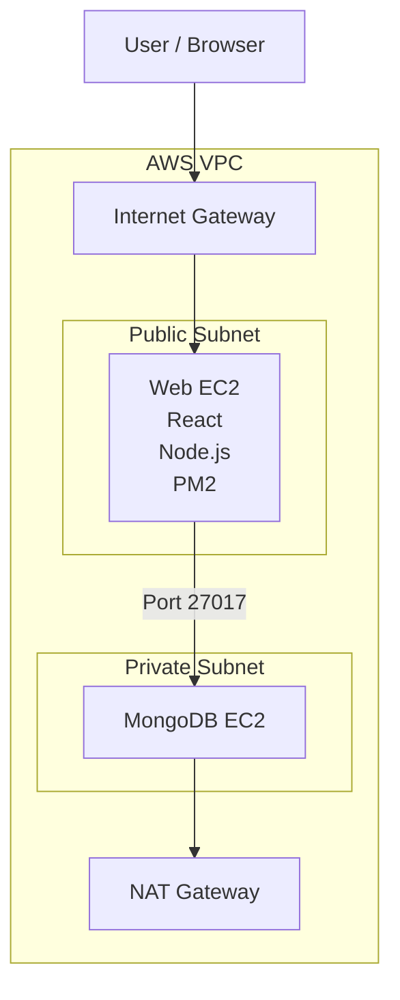

# TravelMemory MERN Stack Deployment on AWS (Terraform + Ansible)


## Introduction

This project demonstrates the deployment of the TravelMemory MERN (MongoDB, Express.js, React.js, and Node.js) application on AWS using DevOps automation tools. The infrastructure was provisioned using Terraform, while Ansible was used to configure servers, install dependencies, and deploy the application. The solution follows a secure architecture where the web server resides in a public subnet and the MongoDB server is hosted in a private subnet.

### Why Terraform?

Terraform is an Infrastructure as Code (IaC) tool used to provision and manage cloud resources in a declarative manner. Instead of manually creating AWS resources through the console, Terraform allows the entire infrastructure to be defined as code and deployed consistently across environments.

### Benefits of Terraform
 
- Automates infrastructure provisioning and management.
- Ensures consistency and repeatability across deployments.
- Supports version control and collaboration through code.
- Reduces manual configuration errors.
- Enables quick infrastructure recreation and disaster recovery.
- Provides a clear execution plan before applying changes.
- Why Ansible?

### Why Ansible?

Ansible is a configuration management and automation tool used to configure servers, install software, and deploy applications. After Terraform provisions the infrastructure, Ansible automates the setup of the operating system, application dependencies, MongoDB configuration, and application deployment.

### Benefits of Ansible

- Agentless architecture using SSH for communication.
- Simplifies server configuration and application deployment.
- Ensures consistent configuration across multiple servers.
- Uses human-readable YAML playbooks.
- Supports idempotent operations, preventing unnecessary changes.
- Reduces deployment time and operational overhead.


## Project Outcome

By combining Terraform and Ansible, the entire application stack can be provisioned, configured, and deployed automatically with minimal manual intervention. This approach improves scalability, reliability, reproducibility, and maintainability while aligning with industry-standard DevOps practices.

----

## 📌 Project Overview

This project demonstrates the deployment of a **MERN Stack Application (TravelMemory)** on AWS using:

- Terraform (Infrastructure as Code)
- Ansible (Configuration Management)
- AWS EC2 (Web + MongoDB instances)
- PM2 (Process Manager)
- MongoDB (Private Subnet)
- React + Node.js (Frontend + Backend)

---

## 🏗 Architecture


---

## ⚙️ Tech Stack

- AWS EC2
- Terraform
- Ansible
- Node.js (Express)
- React.js
- MongoDB
- PM2
- Git

-----

## 📁 Project Structure

```bash

TravelMemory/
│
├── backend/
│   ├── index.js
│   ├── conn.js
│   ├── routes/
│   └── models/
│
├── frontend/
│   ├── src/
│   └── public/
│
├── terraform/
│   ├── vpc.tf
│   ├── ec2.tf
│   ├── security.tf
│   ├── outputs.tf
│
├── ansible/
│   ├── inventory.ini
│   ├── web.yml
│   ├── mongodb.yml
│   ├── deploy.yml

```

----

## Infrastructure Setup (Terraform)

### Components Created

- VPC with public & private subnet
- Internet Gateway
- NAT Gateway
- Route Tables
- EC2 Web Server (Public Subnet)
- EC2 MongoDB Server (Private Subnet)
- Security Groups
- IAM Roles
- Key Pair (`mern-key`)

---

## 🔐 Security Groups

### Web Server SG

- SSH: 22 (My IP)
- HTTP: 80 (0.0.0.0/0)
- HTTPS: 443
- React: 3000
- Node API: 3001

### MongoDB SG

- SSH: 22 (from Web SG only)
- MongoDB: 27017 (from Web SG only)

----
## 📦 Ansible Configuration

### Inventory

```ini
[web]
<WEB_PUBLIC_IP>

[bastion]
<WEB_PUBLIC_IP>

[mongodb]
<PRIVATE_IP>

[all:vars]
ansible_user=ec2-user
ansible_ssh_private_key_file=~/.ssh/mern-key

[mongodb:vars]
ansible_ssh_common_args='-o ProxyJump=bastion'
```

---

## 🏗 Web Server Setup (web.yml)

Installs:

- Git
- Node.js
- npm
- PM2

-----

## 🚀 Application Deployment (deploy.yml)

Steps:
- Clone GitHub repository
- Install backend dependencies
- Configure .env for backend
- Install frontend dependencies
- Configure .env for frontend
- Start backend using PM2
- Start frontend using PM2

-----

## Environment Variables

**Backend (.env)**

```bash
PORT=3001
MONGO_URI=mongodb://<MONGO_PRIVATE_IP>:27017/travelmemory
```

**Frontend (.env)**

```bash
REACT_APP_BACKEND_URL=http://<WEB_PUBLIC_IP>:3001
```

------

## Application URLs


**Frontend**

```bash
http://<WEB_PUBLIC_IP>:3000
```

**Backend API**

```bash
http://<WEB_PUBLIC_IP>:3001/hello
http://<WEB_PUBLIC_IP>:3001/trip
```
---

## 📊 Process Management (PM2)

```bash
pm2 list
pm2 logs
pm2 restart all
pm2 save
```

---

## 🗄 MongoDB Setup

Database runs on private EC2:

```bash
mongodb://10.0.2.x:27017
```

---

## Key Features Implemented

- VPC with public/private subnet architecture
- Bastion-like access via web server
- Private MongoDB deployment
- Automated provisioning using Terraform
- Configuration using Ansible
- CI-style deployment workflow
- Process management with PM2

----

## Common Commands Used in the Project

### AWS CLI

```bash
aws configure
aws sts get-caller-identity
```

### Terraform

```bash
terraform init
terraform validate
terraform fmt
terraform plan
terraform apply
terraform output
terraform state list
terraform destroy
```

### SSH Connectivity

```bash
ssh -i ~/.ssh/mern-key ec2-user@<WEB_PUBLIC_IP>

ssh -i ~/.ssh/mern-key ec2-user@<MONGO_PRIVATE_IP>

ssh -i ~/.ssh/mern-key -J ec2-user@<WEB_PUBLIC_IP> ec2-user@<MONGO_PRIVATE_IP>
```

### Ansible

```bash
ansible all -i inventory.ini -m ping

ansible web -i inventory.ini -m ping

ansible mongodb -i inventory.ini -m ping

ansible-playbook -i inventory.ini web.yml

ansible-playbook -i inventory.ini mongodb.yml

ansible-playbook -i inventory.ini deploy.yml
```

### Linux Package Management (Amazon Linux 2023)

```bash
sudo dnf update -y

sudo dnf install git -y

sudo dnf install nodejs -y
```

### Git

```bash
git clone https://github.com/UnpredictablePrashant/TravelMemory.git

git status

git pull
```

### Node.js & NPM

```bash
npm install

npm start

npm run build

npm install -g pm2
```

### PM2 Process Management

```bash
pm2 start index.js --name travelmemory

pm2 start "npm start" --name travelmemory-ui

pm2 list

pm2 logs

pm2 logs travelmemory

pm2 logs travelmemory-ui

pm2 restart travelmemory

pm2 restart travelmemory-ui

pm2 delete travelmemory

pm2 delete travelmemory-ui

pm2 save
```

### Service Management

```bash
sudo systemctl status mongod

sudo systemctl start mongod

sudo systemctl restart mongod

sudo systemctl enable mongod
```

### Network Verification

```bash
curl http://localhost:3001/hello

curl http://localhost:3001/trip

ss -tulpn

ss -tulpn | grep 3000

ss -tulpn | grep 3001

ss -tulpn | grep 27017
```

### MongoDB Shell

```bash
mongosh

use travelmemory

show collections

db.trips.find()

db.trips.deleteMany({})

db.dropDatabase()
```

### Log Inspection

```bash
journalctl -u mongod -f

pm2 logs

tail -f ~/.pm2/logs/travelmemory-out.log

tail -f ~/.pm2/logs/travelmemory-error.log
```

-----

## Terraform Destroy

Terraform provides a simple way to remove all provisioned infrastructure when it is no longer needed. The `terraform destroy` command automatically identifies and deletes all resources defined in the Terraform configuration, helping prevent unnecessary AWS costs and ensuring a clean environment.

```bash
terraform destroy
```

Before deleting resources, Terraform displays an execution plan showing which resources will be removed and requests confirmation. This makes infrastructure cleanup safe, predictable, and fully automated.

---


### Author
**Saima Usman**
Jr. DevOps Engineer

DevOps Project - AWS MERN Deployment

